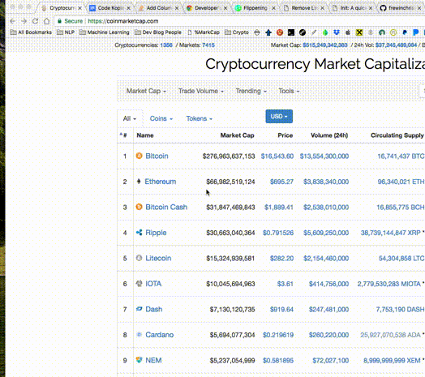

# Markcap bookmarklet

You can copy the bookmarklet over on [frewinchristopher.github.io/markcap](frewinchristopher.github.io/markcap)

Many thanks to [FarhadG](https://github.com/FarhadG) with his init bookmarklet and site - the styles are heavily copied that site. (Note: if you are a developer, [FarhadG](https://github.com/FarhadG)'s tool is very cool!)

You can check out [his repository for INIT here.](https://github.com/FarhadG/init)

If there is enough interest, I could also make a Chrome extension for this - which would probably be a bit more user friendly.
